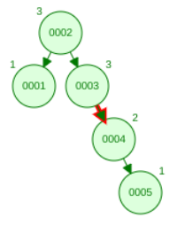
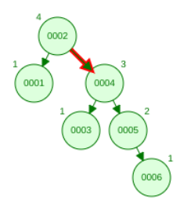
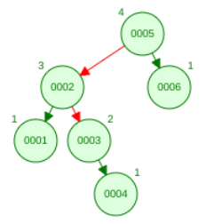
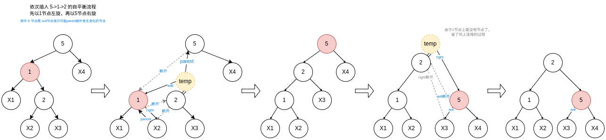

# 平衡二叉树

为了平衡左右子树高度，降低搜索的时间复杂度。

**特点：**

在二叉搜索树基础上新增平衡的特点（每个节点的左右子树的高度差不超过1）。

并非理想的平衡，参考《数据结构与算法分析》的图4-30。

**理论支撑：**

为何下面说的左旋、右旋可以维持树的平衡 以及 复杂度分析，参考这篇古老的论文（如果数学功底好能看懂的话） https://zhjwpku.com/assets/pdf/AED2-10-avl-paper.pdf。

**平衡算法：**

1. 按**BST**规则先插入新节点，然后从新节点反向到根节点**重新计算各层父节点的平衡因子**（左子树高度减右子树高度的差）；

   这里需要节点中定义父节点引用（parent 反向更新高度）、节点高度（height），可以继承BST树的代码；

2. 找出**最靠近**新插入的叶子的**不平衡节点**（左右子节点高度差为2）；

   如下图1的"0003"、图2的"0002"就是要旋转的目标节点。

3. 判断**不平衡类型**，分为4种类型（A-B，A是不平衡节点的不平衡类型，B是不平衡节点的被关注子树的不平衡类型）；

   + **左-左**（对**目标节点**进行一次**右旋**）

     目标节点的平衡因子为2是**左**型，且目标节点为根的树的左子节点平衡因子>=0，是**左-左**型；

   + **左-右**（对**目标节点左子树**进行一次**左旋**，再对**目标节点**进行一次**右旋**）

     目标节点的平衡因子为2是**左**型；且目标节点为根的树的左子节点平衡因子<0，是**左-右**型；

   + **右-左**（对**目标节点右子树**进行一次**右旋**，再对**目标节点**进行一次**左旋**）

     目标节点的平衡因子为-2是**右**型；且目标节点为根的树的右子节点平衡因子>=0，是**右-左**型；

   + **右-右**（对**目标节点**进行一次**左旋**）

     目标节点的平衡因子为-2是**右**型；且目标节点为根的树的右子节点平衡因子<0，是**右-右**型；

   **如**：图1目标节点0003平衡因子是-2，右子节点平衡因子是-1，是右右型，所以只需要一次左旋；

   图1目标节点0002平衡因子是-2，右子节点0004平衡因子是-1，是右右型，所以只需要一次左旋；

   图3目标节点0005平衡因子是2，左子节点0002平衡因子是-1,是左右型，先对0002子树左旋，再对0005右旋。

     

4. 左旋 & 右旋

   

> 理清上面的流程之后，就可以手写AVL实现了。如果写不出来，说明有细节还没理清楚；
>
> 实在理不清楚就看别人写的完整的代码实现吧，不建议看书，找了几本书，没有一个把细节能讲的很细的（配的代码也不完整），这里上面写流程也没法将所有细节描述地很清除，文字表现力还是太弱了，还不如直接看完整的源码。

**节点定义：**

```java
//value left right 还是BST节点的属性
public T value;
public Node left;
public Node right;
public Node parent;	//主要用于AVL自平衡时从新插入节点，反向更新树的高度
public int height;	//AVL节点的高度
```

**代码实现**：

源码Demo: tree:AVLTree。


