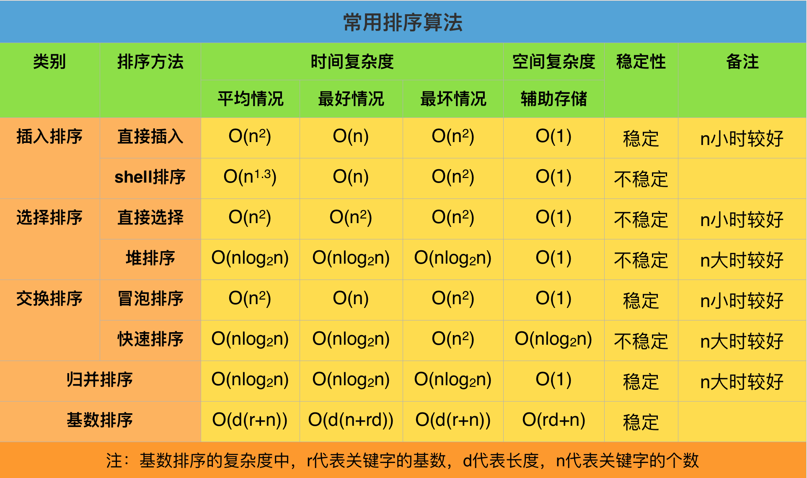

# 排序算法

算法思想，时间复杂度，空间复杂度。

两类排序算法中在不知道待排序数特点的情况下，普适性能最佳者分别为**归并排序**和**基数排序**。
当然具体情况需要具体分析，根据待排序数和各排序算法的特点选择合适的排序算法。

理解清楚排序算法的原理，实现起来还是挺简单的。

## 排序算法分类

### 比较类非线性时间排序  

+ **选择排序**（最常见的思维方式）  
  排序思想：  
  第1次，从索引0到n-1的队列中找出最小的值与最左端的值(索引为0)进行交换；  
  第2次，从索引1到n-1的队列中找出最小的值与索引为1的值进行交换；  
  第n-1次，从索引n-2到n-1的队列中找出最小的值与索引为n-2的值进行交换。  

  时间复杂度： O(N^2) [比较次数：O(N^2) 交换次数：O(N)]  
  空间复杂度： O(1)

  比较次数： n*(n-1)/2  
  交换次数： n-1

* **冒泡排序** 
    
    排序思想：  
    从左向右两两相邻比较先把最大的换到右边去。    
    第1次，从索引0到n-1,两两比较左边的值小于右边的值则不互换，否则互换(第一轮过后，索引n-1的值一定是最大的);  
    第2次，从索引0到n-2,两两比较左边的值小于右边的值则不互换，否则互换(第二轮过后，索引n-2的值一定是0到n-2里最大的);  
    第n-2次，从索引0-1,两两比较左边的值小于右边的值则不互换，否则互换。  
    
    时间复杂度： O(N^2) [比较次数：O(N^2) 交换次数：O(N^2)]  
    空间复杂度： O(1)
    
    比较次数： n*(n-1)/2  
    交换次数： n*(n-1)/2

+ **插入排序**
  排序思想：  
  和算法的名字一样，从索引1开始，取出元素值与左边元素比较插入适当的位置，然后取索引为2的元素插入左边，循环。    
  第1次，取索引1的值，与索引为0的比较,索引1的元素大于索引0的元素则不互换，否则互换(第一轮过后，索引0到1的元素是有序的);  
  第2次，取索引2的值，与索引为0，1比较，按从小到大的顺序选择合适的地方插入（第二轮过后，索引0到2的元素是有序的）;  
  第n-1次，取索引n-1的值,与索引为0到n-2的值比较，按从小到大的顺序选择合适的地方插入。  

  时间复杂度： O(N^2) [比较次数：O(N^2) 交换次数：O(N^2)]  
  空间复杂度： O(1)

  使用二分法插入的话：  
  最糟糕情况下比较次数：1+(2/2+1)+(3/2+1)+(4/2+1)+...+((n-1)/2+1) = (n^2+4*n-5)/4   
  最糟糕情况下交换次数：(n^2+4*n-5)/4 

* **快速排序**  
    在冒泡排序基础上发展出来的一种思想。书上对原理解释了三页，代码实现两页，直接看代码吧，把代码抄下来，
    一个循环一个循环地调试（或者看usfca那个网站演示快排，结合代码调试应该更好理解，因为涉及递归）。  
    
    <u>调试后得出排序思想</u>：
    
    三个标量：基准元素M（初始为第一个元素）, leftPointer（初始指向第二个元素）, rightPointer（初始指向最后一个元素）。
    
    １）从leftPointer开始往后依次查找（leftPointer++）大于M的元素和rightPointer开始往前查找小于M的元素交换（交换后rightPointer--），然后循环继续这一操作，直到leftPointer>rightPointer，然后把M与rightPointer位置元素互换; 这时会发现以M为基准，小于M的元素全部在左边大于M的元素全部在右边。
    
    ２）然后开始分治，Ｍ左边一块右边一块，分别重新选定各自新的基准元素M,重复执行上面的操作。
    
    <u>如下排序过程</u>：
    
    ```java
    /**
     * {2, 8, 6, 0, 3, 7, 4, 2, 1, 9, 5}
     *     l                          r
     *                          r <---
     * {2, 1, 6, 0, 3, 7, 4, 2, 8, 9, 5}  //left、right指针位置元素互换
     *        l              r
     *           r <---------
     * {2, 1, 0, 6, 3, 7, 4, 2, 8, 9, 5}  //left、right指针位置元素互换
     *        r  l    
     * {0, 1, 2, 6, 3, 7, 4, 2, 8, 9, 5}  //M、right指针位置元素互换
     * 　　　　M
     * 分治：
     * {0, 1}   {6, 3, 7, 4, 2, 8, 9, 5}
     * {0, 1}   {6, 3, 5, 4, 2, 8, 9, 7}
     *          {2, 3, 5, 4, 6, 8, 9, 7}
     *          　　　　　　　 M
     * 分治：
     *          {2, 3, 5, 4}   {8, 9, 7}
     *           M             {8, 7, 9}
     *                         {7, 8, 9}
     *                             M
     * 分治：
     *             {3, 5, 4}   {7}   {9}
     *              M
     * 分治：
     *                {5, 4}
     *                {4, 5}
     * 最终结果：
     * {0, 1, 2, 2, 3, 4, 5, 6, 7, 8, 9}
    **/
    ```
    
    疑问：  
    1）快排为何是不稳定的？  
        表示两个值相同的元素在排序前后是否有位置变化。如果前后位置变化，则排序算法是不稳定的，否则是稳定的。
        稳定性的定义符合常理，两个值相同的元素无需再次交换位置，交换位置是做了一次无用功。  
        这个无用功可以避免的。   
    2）最糟糕情况的复杂度为何算出是O(N^2)?  
        最糟糕的情况是数列与我们的要求是相反的倒序排列，每次划分只得到一个比上一次划分少一个记录的子序列，注意另一个为空。如果递归树画出来，它就是一棵斜树。
        此时需要执行n‐1次递归调用，且第i次划分需要经过n‐i次关键字的比较才能找到第i个记录，也就是枢轴的位置，
        因此比较次数为 (n-1)+(n-2)+...+1=n*(n-1)/2;  
        相应的最好的情况是每次都拆分均匀，得到一颗完整平衡二叉树。
    
        还以QuickSort.java为例，最好情况是，如： 1 2 4 3 6 7 9 10 8 5。
        对于最优情况，树的深度为h 2^(h-1)<n<2^h h=log2n (这里2为底数)，每一层的比较几乎都是n(+1)次，总比较大约为nlog2n。

* **希尔排序**
    排序思想：  
    在插入排序基础上添加n-增量排序减小间隔的优化。
    比如元素个数为9，设定初始增量为4，则分成了4组(0,4,8), (1,5,9),(2,6)(3,7)，组内先进行排序；
    通过这种方法使得相似大小的数呈现群聚状态；然后再使用增量为1的插入排序（普通的插入排序）对队列排序。
    经过增量排序处理之后，再使用插入排序，每次插入数据普遍只需要比较以及移动一两位。
    如果数据量较大几千几万那种，可以逐步进行...,1093,364,121,40,13,4,1增量排序。
    
    参考：《数据结构(Java版)》 第7章 高级排序 希尔排序  

* **堆排序**  
    使用了堆树的特性，最大堆的堆顶是堆里面最大的数；而最小堆的堆顶为堆里面最小的数；通过insert或remove操作
    之后仍旧满足堆的特性。  
    
    关于堆的结构和 insert、remove操作参考 datastructure/tree/heap/tree.md 
    
    排序思想：  
    实现堆树（最大堆：升序排序，最小堆：降序排序）以及堆的自动调整（在插入及取出顶端数据之后）；  
    将数列输入（ insert() ）堆树；   
    将数据从堆树取出( remove() )放回原来的数列。  

+ **归并排序**

  + **二路归并排序**
  + **多路归并排序**

  [归并排序复杂度分析](https://blog.csdn.net/qq_28382071/article/details/81154164)

### 非比较类线性时间排序

- **计数排序**
- **桶排序**
- **基数排序**

## 算法好坏评定

算法好坏评定标准：

+ 时间复杂度（执行效率）

  + 最好情况、最坏情况、平均情况时间复杂度
  + 时间复杂度的系数、常数 、低阶
  + 比较次数和交换（或移动）次数

+ 空间复杂度（内存消耗）

  原地排序算法（O(1)）

+ 稳定性

  经过排序之后，相等元素之间原有的先后顺序不变，就是稳定的。

各算法对比: 

！注意下面图中有错误：选择排序是稳定的。




## Leecode相关练习题

75 Sort Colors
21 Merge Two Sorted Lists 
23 Merge k Sorted Lists 
4 Median of Two Sorted Arrays 
88 Merge Sorted Array 
687	Longest Univalue Path 
349 Intersection of Two Arrays	
350 Intersection of Two Arrays II


参考：  
面试中的 10 大排序算法总结 http://www.codeceo.com/article/10-sort-algorithm-interview.html