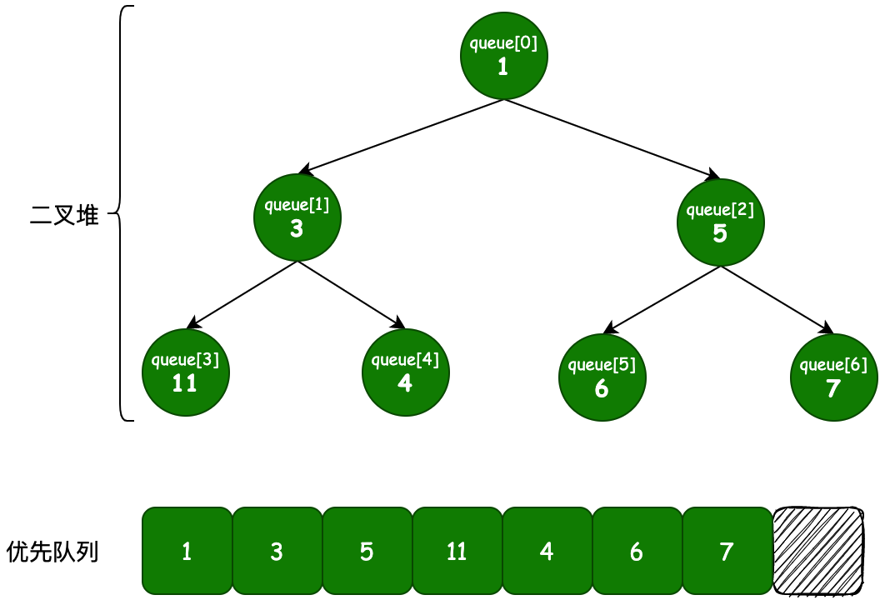

# 队列


## 优先队列

优先队列是一个元素都有优先级，元素按照优先级出队的队列。

适用于按优先级出队的场景，如：商品促销优先卖给VIP用户、高优先级任务优先调度。

JDK提供了两个优先级队列实现：

+ java.util.PriorityQueue
+ java.util.concurrent.PriorityBlockingQueue

前者是非线程安全的，后者是线程安全的。

### PriorityQueue

默认初始容量：11；

容器是数组；算法体现是二叉堆（如果值小的在堆顶就是最小堆，否则是最大堆）；元素越靠堆顶存储在数组的位置越靠前；

优先级规则默认由元素类型的 **Comparable** 接口方法决定；

只保证每个路径从上到下的优先级顺序，不保证同层节点的优先级顺序。



如图，如果传的值是 int, 则按 Integer compareTo() 方法计算优先级。值越小优先级越高。

**父子节点索引规律**：

idx=0 的子节点 idx=1,2

idx=1 的子节点 idx=3,4

idx=3 的子节点 idx=8,8+1

idx=n 的子节点 idx=?, ?+1

**转成数学问题**：**即求父节点索引n和两个子节点索引 n1,n1+1的关系？**（理解了它们之间的关系就理解了代码算法原理）

看最右边一列数 0、2、6、14，不就是 2^1-2、2^2-2，2^3-2 ... 么，即设层数为 h，这层最右边的元素索引是n，即有 2^h-2 = n，下一层最右边的元素索引b满足 2^(h+1) - 2 = b，求解得到 n = (b-2)/2，b左侧相邻子节点a满足 n = (a-1)/2。

**`n = (b-2)/2` 与 `n = (a-1)/2` 且 `b=a+1`, b为偶数a为奇数，体现在代码上 就是 `n = (k - 1) >>> 1`;**

根据上面推论更直观的代码可能是

```java
//入对查父节点
if ((k & 1) == 1)           //奇数（左子节点索引）
	parent = (k - 1) >>> 1;
else    // ((k & 1) == 0)   //偶数（右子节点索引）
	parent = (k - 2) >>> 1;
//但是和下面一行代码是等效的
int parent = (k - 1) >>> 1;
```

入对是通过新元素末尾的索引k求父节点索引parent，

出队则是通过父节点索引parent找两个子节点索引。

```java
//出队查子节点索引
k1 = parent << 1 + 1;
k2 = parent << 1 + 2;
```


**入队算法**：（从叶子节点往上一层一层地查找父节点，优先级大于父节点就与父节点交换位置，否则插入）

```java
private void siftUpComparable(int k, E x) {
    Comparable<? super E> key = (Comparable<? super E>) x;
    while (k > 0) {
        int parent = (k - 1) >>> 1;		//从最后（叶子节点）开始找父节点索引
        Object e = queue[parent];
        if (key.compareTo((E) e) >= 0）
            break;
        queue[k] = e;
        k = parent;
    }
    queue[k] = key;
}
//一种更易理解的写法
private void mySiftUpComparable(int k, E x) {
    Comparable<? super E> key = (Comparable<? super E>) x;
    while (k > 0) {
        //1）获取父节点索引
        int parent; //父节点索引
        if ((k & 1) == 1)           //奇数（左子节点索引）
            parent = (k - 1) >>> 1;
        else    // ((k & 1) == 0)   //偶数（右子节点索引）
            parent = (k - 2) >>> 1;
        //2）
        Object e = queue[parent];
        if (key.compareTo((E) e) >= 0)  // key >= e, 跳出循环，直接赋值 即（放在了靠后的位置）
            break;
        queue[k] = e;                   // key < e, 交换新节点x和父节点e的位置
        k = parent;                     //          现在x在parent位置，然后继续循环与祖父节点比较，直到比较优先级败出或到达根节点
    }
    queue[k] = key;
}
```

**出队算法**：

```java
private void siftDownComparable(int k, E x) {
    Comparable<? super E> key = (Comparable<? super E>)x;
    int half = size >>> 1;        // loop while a non-leaf
    while (k < half) {
        int child = (k << 1) + 1; // assume left child is least
        Object c = queue[child];
        int right = child + 1;
        if (right < size &&
            ((Comparable<? super E>) c).compareTo((E) queue[right]) > 0)
            c = queue[child = right];
        if (key.compareTo((E) c) <= 0)
            break;
        queue[k] = c;
        k = child;
    }
    queue[k] = key;
}
```

### PriorityBlockingQueue


## 延迟队列

主要依靠优先队列实现，将**延迟小**的任务设置为**高优先级**。

即以延迟时间为优先级，优先出队延迟小的节点的队列。

一个常见的应用场景是实现延迟任务（计划任务）。

延迟任务的场景：

1）红包 24 小时未被查收返还给原账户；

2）订单下单后30分钟未支付，自动取消订单；

3）电信运营商在用户的月结日给用户推送账户余额信息。

JDK官方实现：

+ java.util.concurrent.DelayQueue

  