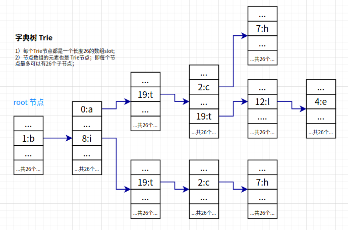

# 字典树

## 数据结构

字典树主要是弄清楚他的数据结构，算法实现并不难理解，他的每个节点都存储字符数据，最多存储26个字符。



节点的一种代码表示：

```java
static class Node {
    /** 子节点数组 */
    Node[] slot = new Node[26];
    /** 该节点存储的字符 */
    char c;
    /** 标识这个字符是否为一个单词的结尾 */
    boolean isWord;
    /** 当前字符组成的单词个数 */
    boolean count;
}
```

