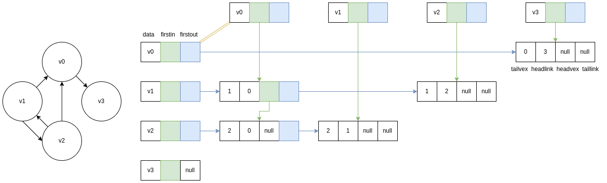
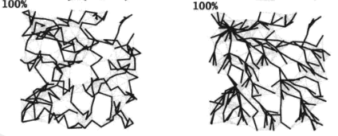
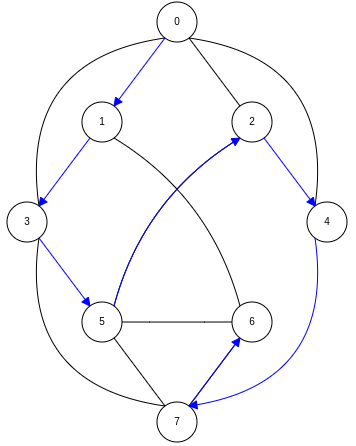
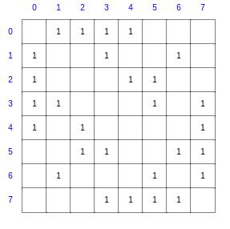
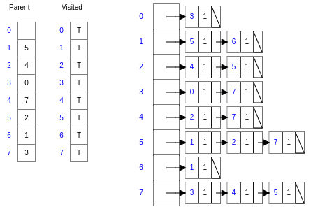
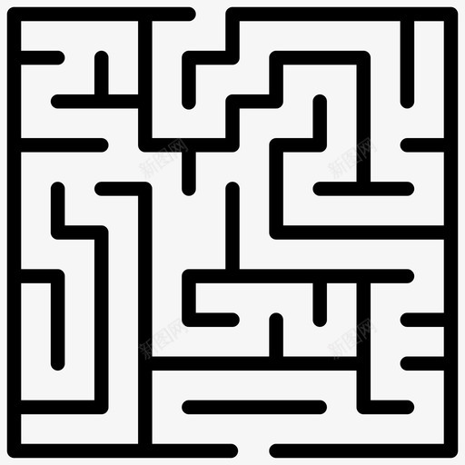
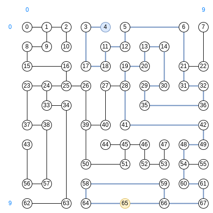
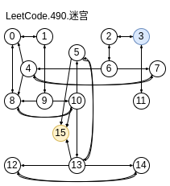
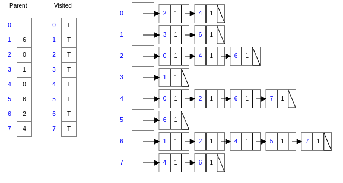
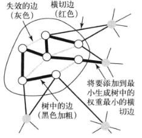

# 图

图是一种比树结构复杂的非线性的数据结构。

图是由**顶点**(vertex)的有穷非空集合和顶点之间**边**(edge)的集合组成，通常表示为：G(V,E) = 【G表示图、V表示顶点个数、E表示边的个数】。图的数据结构是多对多关系。树是1对多关系，所以树也是一种特殊的没有闭环的图。

> 顶点也有称为**结点**的，有向的边也称为**弧**(arc)。
>
> 带权的图也称为**网**。
>
> 算法的思路和细节证明是重点，这些理清后，代码实现反而简单。


## 常见场景

地图相关（路线规划、外卖任务分配）、网页链接（搜索场景）、任务调度、社交应用（朋友推荐）等。这些场景对图的应用还是比较多的。

个人并没经过这些场景，很少接触图的应用，只做过一个查找两人所在省份间跨越了几个省份（按最少的记）的需求，以及看Skywalking-Agent源码时了解到链路追踪Span存储的是一个有向无环图，展示方法调用链路的时候用到图的遍历。


## 边的分类与表示

+ 边是否有向

  + **无向边**

    连接顶点A、D的无向边：（A,D）或 （D,A）

  + **有向边**

    从A到D的有向边：<A,D>, 有向边又称为弧，A是弧尾，D是弧头（定义有点反人类）

+ 边是否有权重
  + **无权重**
  + **有权重**

> 度：以顶点v为头的弧的数目称为v的入度（InDegree）, 以v为尾的弧的数目称为v的出度（OutDegree）。


## 图的分类与表示

+ 边是否有向

  + **有向图** （Digraph）

    + **有向完全图**

      在有向图中，任意两个顶点之间都存在方向且互为相反的两条弧（共n*(n-1)条弧）。

  + **无向图 **

    + **无向完全图**

      无向图中任意两个顶点之间都存在边（共 n*(n-1)/2条边）。

+ 边或弧的多少（这里是相对的概念，只能说一个图相对另一个图是稀疏还是稠密）
  + **稀疏图**
  + **稠密图**

+ 顶点是否存在指向自身的边、连接两个顶点的边是否有多条

  + **简单图**

    没有指向自身的边、连接两个顶点的边没有多条

+ 任意两个顶点是否连通
  + **连通图**

> 回路（环）：第一个顶点到最后一个顶点相同的路径成为回路或环（即从某个顶点开始最后可以回到这个顶点但是中间不会重复走过其他顶点），有向图中需要按边的方向行走可以满足上面条件才是有环。
>
> 简单回路（简单环）：只有第一个顶点到最后一个顶点相同的路径成为回路或环（即从某个顶点开始最后可以回到这个顶点但是中间不会重复走过其他顶点）。
>
> 比如一个无向图：G=(V,{E}) , V = {A,B,C,D}, E={(A,B), (B,C), (A,C), (A,D), (C,D)}, B->C->D->A->B 是一个环，B->C->D->A->C->B 也是一个环，前面的是简单回路，后面的是不是简单回路。参考：《大话数据结构》图7-2-11。
>
> 连通分量：无向图中最大连通子图称为连通分量。
>
> 两个顶点都存在互相可达的有向路径，则称它们是强连通的。
>
> 强连通图：任意两个顶点都是强连通的图。


## 图的数据结构

下面看下几本书提供的数据结构。

> 书里示例的数据结构实现也仅仅只是演示，用到业务中除非数据很少，否则远远达不到性能要求。要封装一个性能不错，可以存储很多数据的，且包含相对较全面的接口方法，还是有一定难度的。想下一个简单的HashMap都考虑了多少东西。
>
> 企业级的图的算法实现可以研究下Neo4J的数据结构。

### 邻接矩阵

基本容器是**二维数组**。行表示某顶点的出度，列表示某顶点的入度。

优点：比较直观（易理解）；支持有向图和无向图。

缺点：对于稀疏图来说，可能造成存储空间的巨大浪费。

### 邻接表

《大话数据结构》中邻接表数据结构：**数组+单向链表**（像冲突元素较少的HashMap的数据结构），边只记录出边。

```c
typedef struct VertexNode {
	VertexType data;			//顶点数据信息
	EdgeNode *firstedge;		//边节点的头节点指针，指向当前顶点的其中一个出边节点，
} VertexNode, AdjList[MAXVEX];	//顶点节点

typedef struct EdgeNode {		
	int adjvex;					//顶点节点数组的索引
	EdgeType weight;			//边的权重
	struct EdgeNode *next;		//下一个出边节点，单向链表,链表存储索引为adjvex的顶点的所有边节点
} EdgeNode;						//边节点
```

《算法》中提供的数据结构

```java
private final int V;                // number of vertices in this digraph
private int E;                      // number of edges in this digraph
private Bag<DirectedEdge>[] adj;    // adj[v] = adjacency list for vertex v
private int[] indegree;             // indegree[v] = indegree of vertex v
```

还有**逆邻接表**，边只记录入边。

优点：节省空间；

缺点：无法快速判断两个节点是否相邻（需要遍历节点的邻居），不适合存储有向图。

可以将链表优化为红黑树等实现，以加快元素查找和遍历效率。

### 十字链表

针对**有向图**的数据结构。

就是**邻接表+逆邻接表**，将节点链表改成双向的链表。

```c
typedef struct VertexNode {
	VertexType data;			//顶点数据信息
	EdgeNode *firstin;			//入边节点的头节点指针，指向当前顶点的其中一个入边节点，
	EdgeNode *firstout;			//出边节点的头节点指针，指向当前顶点的其中一个出边节点，
} VertexNode, AdjList[MAXVEX];	//顶点节点

typedef struct EdgeNode {		
	int tailvex;				//弧尾对应顶点节点在数组的索引
    int headvex;				//弧头对应顶点节点在数组的索引
	EdgeType weight;			//边的权重
	struct EdgeNode *headlink;	//下一个入边节点，单向链表,链表存储索引为adjvex的顶点的所有边节点
    struct EdgeNode *taillink;	//下一个出边节点，单向链表,链表存储索引为adjvex的顶点的所有边节点
} EdgeNode;						//边节点
```

**书上画的图并没有把这个"十字"体现出来，这里重新画个图，就明白为何叫做十字链表了。**



即就是把两个邻接表十字交叉组合在一起了。横向链表查询节点所有出边，纵向链表查询节点所有入边。

### 邻接多重表

针对**无向图**的数据结构。

一个图随着边的插入顺序不同，数据存储是不同的。


## 图的操作

包括基本的对顶点的增删改查，对图的创建、销毁，查找邻接顶点；

还有对图的遍历、查找最短路径、最小生成树等等较常用的操作。

### 图的遍历

理解图的遍历**需要从其实际数据的存储数据结构上理解**，比如无向图即使同一张图，因为顶点和边插入顺序不同，实际存储数据的结构也可能不一样，遍历的顺序也就可能不同，不过规则相同，但是实际数据结构确定的话遍历顺序是固定的。

不从实际数据结构上理解，而只是从逻辑图上理解势必会懵比的，比如《算法》图4.1.14, 只看左边不看右边，肯定悟不出来他到底是按什么规则遍历的。

> 从遍历流程上给人的直观感觉：
>
> **DFS: 从起点顶点开始将碰到第一邻接顶点v作为新的起点查找下一个邻接顶点，然后一直深入，每次总是尽可能串起来更多的顶点。**
>
> **BFS: 从起点顶点开始每次深入一层（距离=1），遍历这层所有顶点，然后以这层顶点为新的起点，遍历下一层（距离+1）。**
>
> 只要是连通图，DFS和BFS便可以一次遍历所有顶点，即遍历的路径可将所有的顶点全部连接起来。
>
> 

#### 深度优先搜索DFS

参考：https://www.cs.usfca.edu/~galles/visualization/DFS.html

##### 对于邻接矩阵

创建一个和顶点数组一样长的数组用于记录某个顶点是否被访问过。首先最外层遍历(假设矩阵是arc) `arc[i][]` , 内层遍历 `arc[i][j]`,  每找到一个邻接顶点就一直深入。

如图：对应邻接矩阵：

**遍历过程**：0-1-3-5-2-4-7-6。

测试Demo: `AdjacencyMatrixWeightedGraphTest#testDFSAndBFS()`

##### 对于邻接表等

创建一个和顶点数组一样长的数组用于记录某个顶点是否被访问过。首先最外层建立遍历顶点数组（这个遍历仅仅是防止是**非连通图**），然后从顶点数组开始第一个顶点开始探索其链表，每探索到一个新的顶点就转到对应顶点的链表查询新的顶点。



**遍历过程**：0-3-7-4-2-5-1-6。

##### DFS的一些应用

+ **是否是连通图**

  对于连通图，从某顶点开始只需一次遍历即可，不需要再遍历顶点数组。如下：连通图只会打印一次"遍历次数：+1"。

  ```java
  private void dfs(boolean[] visited, int vexIndex, boolean outer) {
      if (visited == null) {
          visited = new boolean[numVertex];
          Arrays.fill(visited, false);
          outer = true;
      }
      if (outer) {
          for (int i = vexIndex; i < numVertex + vexIndex; i++) {
              int index = i >= numVertex ? i - numVertex : i;
              if (!visited[index]) {
                  //System.out.println("遍历次数：+1");    //连通图只需要一次深度遍历
                  dfs(visited, index, false);
              }
          }
      } else {
          System.out.print(vexs[vexIndex].data + " ");
          visited[vexIndex] = true;
          for (int i = 0; i < numVertex; i++) {
              if (arc[vexIndex][i] != null && !visited[i]) {    //有邻接顶点且未被访问过
                  dfs(visited, i, false);
              }
          }
      }
  }
  ```

  所以判断方法：从任意顶点开始执行一次深度优先搜索，然后查看顶点数组中是否存在未被访问过的顶点。

+ **查找所有连通分量**

  从任意顶点出发执行一次DFS就可以获得一个联通分量；

  DFS遍历剩下未被访问的顶点可以获取其他联通分量。

  其他算法：union-find算法。

+ **寻找路径**

  从起点s到目的顶点v是否存在一条路径？

  仅仅需要从s开始执行一次DFS即可（如果s、v在同一连通子图上一定有解），BFS也可以用于寻找路径，而且求解的路线还是最短路线（忽略权重情况下）。

  寻找路径问题核心就是**构造从终点到起点的链表**，然后借助栈反向打印链表的值即可获取路径。

  > 链表也不必非要用指针/引用实现，数组同样可以，此处尝试用引用实现链表发现很难，而用数组却很简单。
  >
  > ```java
  > private void bfs(int s) {
  >     Queue<Integer> queue = new ArrayDeque<>();
  >     Arrays.fill(visited, false);
  > 
  >     visited[s] = true;
  >     queue.add(s);
  >     while (!queue.isEmpty()) {
  >         Integer idx = queue.poll();
  >         for (int j = 0; j < numVertex; j++) {
  >             if (arc[idx][j] != null && !visited[j]) {
  >                 //核心就这一句
  >                 edgeTo[j] = idx;    //edgeTo数组存储到达每个顶点的前一个顶点索引
  >                 					//这个数组正好将顶点构成了链表，到达索引为idx顶点的前一个顶点就是的索引就是 edgeTo[idx]
  >                 visited[j] = true;
  >                 queue.add(j);
  >             }
  >         }
  >     }
  > }
  > //比如后面无向迷宫
  > // edgeTo[65]=66
  > // edgeTo[66]=67
  > // ...
  > ```

  + **走迷宫**

    走迷宫其实就是寻找路径问题。

    如图（10×10）假如从上进，从下出，将迷宫中每个路口或拐点作为一个顶点，可以抽象出来一张无向图。

    

    抽象出的无向图：

    

    

    **DFS走迷宫**：

    路径：4 3 17 18 11 12 5 6 21 31 32 36 35 29 30 14 13 20 19 28 41 42 49 48 54 60 61 67 66 59 58 64 65 

    测试Demo: `UndirectedMazeTest#testDFSSoluteMaze()`。

    使用DFS走迷宫不会确保是最短路经。

    **BFS走迷宫**：

    路径：4 3 17 18 11 12 5 6 21 31 32 36 35 29 30 14 13 20 19 28 41 42 49 48 54 60 61 67 66 65 

    测试Demo: `UndirectedMazeTest#testBFSSoluteMaze()`。

    使用DFS走迷宫可以确保是最短路经。

    **另外看下LeetCode.490迷宫**：

    这个迷宫和上面的迷宫有一点不一样：<u>除非碰到墙否则不会停下</u>，**其实抽象出来是个有向图（这个抽象过程才是最主要的），另外如果出口在某个不会停下来的点还需要再加个顶点**，如下图；

    使用DFS或BFS求解倒是和普通迷宫没有什么差别。

    

+ **判断是否有环**

  不包括判断自环或平行边。

  有环即DFS过程中肯定会碰到走到的当前顶点已经被访问过这种情况，BFS其实也可以。

#### 广度优先搜索BFS

又称为宽度优先搜索，按深度一层层遍历(如：遍历离起点顶点v深度1的所有顶点，然后是深度为2的所有顶点，...)。

参考：https://www.cs.usfca.edu/~galles/visualization/BFS.html

**对于邻接矩阵**：

如前面的图（1.5.1.1.1）:

遍历过程：0-1-2-3-4-6-5-7。

**对于邻接表等**：

如前面的图（1.5.1.1.2）:



如图遍历过程：0-2-4-6-7-1-3, DFS的话：0-2-4-6-1-3-5

这里可能会有个问题为何要这样遍历？不能按顶点数组一行一行地遍历么？（其实这种直观的方法性能最差）

关于这个参考：《算法引论》**引理7.5：如果边(u,w)属于一颗BFS树，其中u是w的父母，则在具有导向w的边的顶点中，u具有最小的BFS数。**换句话就是说：<u>公认的BFS方法可以尽可能经历更少的步数找到目标顶点</u>。

### 最小生成树

用于解决**构建连通图问题**。以最小代价构造出的连通图就是最小生成树（这图看起来就是一颗树）。

主要研究**无向加权连通图**。

两种算法：Prim算法、Kruskal算法。

使用场景：比如架设网路、电路、修筑公路，如何以最小的成本连接所有城镇。

#### 基础理论

+ **切分定理**（核心）

  **在一幅加权图中，给定任意的切分，它的横切边中权重最小者必然属于图的最小生成树**。

  通过反证法证明。

  横切边：将图的所有顶点分为两个非空且不重复的集合，横切边是一条连接两个属于不通集合的顶点的边。

  假设所有边的权重均不相同的前提下，每幅连通图都只有一棵唯一的最小生成树。

+ **贪心算法**

  求解最小生成树的过程是贪心算法的特殊情况：使用切分定理找到最小生成树的一条边，不断重复直到找到最小生成树的所有边。
  
  后面的两种经典算法也属于贪心算法的思想。

+ **边权重值相同的处理**

  如果这两条边之间不会比较无妨（比如没有共同的顶点），否则从权重值相同的边中每次选一条重新构造子图，计算每个子图的最小生成树，最后比较。

#### Prim算法

Prim算法流程：从任意一个顶点开始，假设将其计为T, 找与T邻接的所有顶点及对应的边，选择其中权重最小的边和顶点加入T，然后重复，直到找到V-1条边。

《算法》的这张配图还是很形象的。



理解清流程（这个才是重点）后，代码实现其实比较简单, 参考测试Demo: `PrimLazyMSTTest#testLazyMST()`。

```java
private Queue<Edge> mst;     // edges in the MST
private boolean[] marked;    // marked[v] = true iff v on tree
private double weight;       // total weight of MST
private MinPQ<Edge> pq;      // edges with one endpoint in tree

private void prim(AdjacencyListWeightedGraph G, int s) {
    //1 扫描所有连接顶点s的边，加入到优先队列pq，（这里用优先队列提升每次筛选权重最小边的效率）
    scan(G, s);
    while (!pq.isEmpty()) {                        // better to stop when mst has V-1 edges
        //2 筛选权重最小的边并从优先队列中删除(pq中保留其他几条边)
        pq.print();
        StdOut.println("----------------------");
        Edge e = pq.delMin();                      // smallest edge on pq
        //3 将筛选出的边和顶点加入最小生成树
        int v = e.either(), w = e.other(v);        // two endpoints
        assert marked[v] || marked[w];
        if (marked[v] && marked[w]) continue;      // lazy, both v and w already scanned
        mst.enqueue(e);                            // add e to MST
        weight += e.weight();
        //4 扫描新的最小生成树外围边，由于之前扫描的边还保留着（第2步），这次只需要扫描新增顶点的外围边即可
        if (!marked[v]) scan(G, v);               // v becomes part of tree
        if (!marked[w]) scan(G, w);               // w becomes part of tree
    }
}
```

**算法优化**：

上面算法第2步只是将加入最小生成树的边从队列中删除了，但是实际可能还可以删除更多无效的边，比如上面的配图，从上到下有7条边（前面的扫描会将这些边加入优先队列），上面算法经过这轮计算只是刷选出了第4条并从优先队列中删除加入了最小生成树，**其实第3条也无效了可以从优先队列中删除，第1条和第2条、第6条和第7条都可以二选一选权重小的保留在优先队列中**（甚至扫描阶段都不应该将这些失效的边加进来），从而可以减少空间占用和计算效率。

优化后的扫描算法（用到了索引优先队列）：

```java
private Edge[] edgeTo;        // edgeTo[v] = shortest edge from tree vertex to non-tree vertex
private double[] distTo;      // distTo[v] = weight of shortest such edge
private boolean[] marked;     // marked[v] = true if v on tree, false otherwise
private IndexMinPQ<Double> pq;	//值越小优先级越高在数组中的索引越小

private void scan(AdjacencyListWeightedGraph G, int v) {
    marked[v] = true;
    for (Edge e : G.adj(v)) {
        int w = e.other(v);
        if (marked[w]) continue;         // v-w is obsolete edge
        if (e.weight() < distTo[w]) {
            distTo[w] = e.weight();
            edgeTo[w] = e;
            //上面可能失效的边根本就不会加进来
            if (pq.contains(w)) pq.decreaseKey(w, distTo[w]);
            else                pq.insert(w, distTo[w]);
        }
    }
}
```

#### Kruskal算法

**Prim算法思想**：对含V个顶点的加权无向图，将边按权重从小到大排序，从最小权重的边开始加入最小生成树，每次加入边需要避免生成环（生成环的话去掉最后加入的边），直到树中含有V-1条边。

**环的判断**：判断并查集是否相交（这个其实是重点）。

这个算法相比Prim算法更容易理解。

Krusakal算法 比 Prim算法一般还是要慢一些，因为每次还需要进行一次连接操作（即避免生成环的操作）。

测试Demo: `KruskalMSTTest#testMST()`。

### 最短路径 & 最长路径

解决**从顶点A到顶点B获取最短或最长路径问题**。另外可能还需要考虑有向、权重、负权重的影响。

注意：

+ 最短路径问题可能无解（记作无穷），比如起点和终点位于非连通图的两个子图上，或者有向图没有指向终点的有向边。
+ 最短路径解可能不唯一

以s为起点的一颗最短路径树是图的一副子图，包含从s和从s可达的左右顶点。

这里主要研究**加权有向图**。

> BFS 求解加权图的最短路径就显得乏力了。

#### 基础理论

+ 边松弛

+ 顶点松弛

+ **最短路径的最优性条件**

  当且仅当对于从v到w的任意一条边e（v,w是相邻的顶点）， 都满足distTo[w] <= distTo[v] + e.weight() 时，它们是最短路径的长度。

  > distTo[w] <= distTo[v] + e.weight() 反过来就是 **distTo[w] > distTo[v] + e.weight() 就一定不是最短路径长度，接着就是要做松弛操作**。
  >
  > distTo[v] 表示从起点s到顶点v的某条路径的长度。

+ **通用最短路径算法**

  将distTo[s]初始化为0，其他distTo[]元素初始化为无穷大，继续如下操作：放松G中的任意边，直到不存在有效边为止。

  对于任意从s可达的顶点w，在进行这些操作之后，distTo[w]的值即为从s到w的最短路径的长度。

#### 迪杰斯特拉（Dijkstra）算法

适用于解决**权重非负的加权图的单起点最短路径问题**。

**为何无法用于负权重的图的计算**？这其实是Dijkstra算法正常执行的前提，负权重边可能导致算法选择错误的路径，而负权重环会使得算法陷入无限循环。

比如一个带负权重边的无向图： G=(V,{E}) , V = {A,B,C}, E={(A,B,4), (B,C,-3), (A,C,5)}，计算过程中会在B、C间反复横跳。

##### 加权无向图 Dijkstra 求解最短路径

其实就是 **深度优先遍历** + **边松弛**。

```java
//逻辑：
//从起点开始，每次计算从起点到每个邻接顶点的边的距离，如果比之前的距离短则更新记录；
//从邻接顶点中选择最近的顶点，作为新的起点，重复上面步骤；直到遍历完成
pq = new IndexMinPQ<Double>(G.V());
pq.insert(s, distTo[s]);
while (!pq.isEmpty()) {
    int v = pq.delMin();    //pq存储各顶点距离起点的排名，选择最近的顶点作为新的起点
    StdOut.println("delMin: " + v);
    for (Edge e : G.adj(v)) //选择一顶点深入，其实相当于DFS遍历
        relax(e, v);
}

private void relax(Edge e, int v) {
    int w = e.other(v);
    if (distTo[w] > distTo[v] + e.weight()) {   //之前的路径一定不是最短路径，变更为这条更短的路径的距离
        StdOut.println("relax: [" + w + "]: " + distTo[w] +  "->" + (distTo[v] + e.weight()));
        distTo[w] = distTo[v] + e.weight();
        edgeTo[w] = e;
        if (pq.contains(w))
            pq.decreaseKey(w, distTo[w]);       //优先队列重新排名
        else
            pq.insert(w, distTo[w]);
    }
}
//求解过程：
// delMin: 0
// relax: [6]: Infinity->0.58
// relax: [2]: Infinity->0.26
// relax: [4]: Infinity->0.38
// relax: [7]: Infinity->0.16
// delMin: 7
// relax: [1]: Infinity->0.35
// relax: [5]: Infinity->0.44000000000000006	//浮点数精度问题不影响
// delMin: 2
// relax: [3]: Infinity->0.43000000000000005
// delMin: 1
// delMin: 4
// delMin: 3
// delMin: 5
// delMin: 6
//求解结果：
// 0 to 0 (0.00)  
// 0 to 1 (0.35)  1-7 0.19000   0-7 0.16000   
// 0 to 2 (0.26)  0-2 0.26000   
// 0 to 3 (0.43)  2-3 0.17000   0-2 0.26000   
// 0 to 4 (0.38)  0-4 0.38000   
// 0 to 5 (0.44)  5-7 0.28000   0-7 0.16000   
// 0 to 6 (0.58)  6-0 0.58000   
// 0 to 7 (0.16)  0-7 0.16000
```

##### 加权有向图 Dijkstra 求解最短路径

和无向图的求解差别不大，只是查询邻接顶点不一样。

#### Bellman-Ford 算法

**权重可为负、可以包含环**。

**理论依据**：

当且仅当加权有向图中至少存在一条从s到v的有向路径且所有从s到v的有向路径上任意顶点都不存在于任何**负权重环**中时，s到v的最短路径才是存在的（这个很好理解，因为会造成死循环）。

**负权重图的最短路径问题**转化为**负权重环不可达时的最短路径**问题。

算法包含两部分：

+ 负权重环的检测（从某个点开始DFS，重复出现已访问过的顶点就是有环）
+ 遍历 +边松弛

#### Floyd-Warshall 算法

待补充...

### 拓扑排序

拓扑排序将**无环有向图**中所有顶点转成一种线性的次序，满足顶点按边的方向排序。

用于**优化工程管理问题（关注任务排布）**。比如软件开发过程中有很多子任务，有些任务有先后顺序依赖。如何安排工作顺序。

两种算法实现（思路很容易理解）：

+ **[入度数组](https://www.cs.usfca.edu/~galles/visualization/TopoSortIndegree.html)**

  从图中选择入度为0的顶点输出，然后删除此顶点，并删除以此顶点为尾的弧（更新入度个数）。继续重复此步骤，直到输出全部顶点或者不存在入度为0的顶点为止。

+ **[DFS](https://www.cs.usfca.edu/~galles/visualization/TopoSortDFS.html)**

  在DFS过程中判断遍历到的顶点的出度，将出度为0或者所有出边顶点都已经记录的顶点插入栈。继续重复此步骤遍历，最后将顶点出栈即拓扑排序结果。

《算法导论》22.4 章节举了个穿衣服的例子，可以模拟实现下。

比如以《算法》中提供的有向图数据结构为例

```java
private final int V;                // number of vertices in this digraph
private int E;                      // number of edges in this digraph
private Bag<DirectedEdge>[] adj;    // adj[v] = adjacency list for vertex v
private int[] indegree;             // indegree[v] = indegree of vertex v
```

### 关键路径（最长路径）

用于计算**从起点到终点最长的路径的耗时时间（关注整体效能）**；比如预估项目耗时时间，项目完成的最短时间取决于耗时最长的生产线。

修改**最短路径的最优性条件**中的条件，即可推证获取最长路径的最优性条件。

**算法原理**：（和Dijkstra边松弛操作条件相反）先求出拓扑排序，然后按排序结果从顶点开始依次添加邻接顶点和边，并计算路径耗时，**当有多条路径相交于一个顶点时保留最长路径，让较短的边失效**（只是失效较短路径中最后加入的边），重复执行，最后保留下来的从顶点到终点的边组成关键路径（最长路径）。

### 网络流问题

#### 网络流算法

**网络**，其实就是一张有向图，其上的边权称为容量。额外地，它拥有一个源点和汇点。

**流**，如果把网络想象成一个自来水管道网络，那流就是其中流动的水。每条边上的流不能超过它的容量，并且对于除了源点和汇点外的所有点（即中继点），流入的流量都等于流出的流量。

网络流中最常见的问题就是**网络最大流**。假定从源点流出的流量足够多，求能够流入汇点的最大流量。

#### Ford-Fulkerson算法

待补充...

#### Edmond-Karp算法

待补充...

#### Dinic算法

待补充...


## 一些图的实际问题

### 哥尼斯堡桥问题（欧拉图）


## LeetCode图相关的题目

+ **LeetCode.490.迷宫**

  其实就是有向图的遍历。

+ ...
