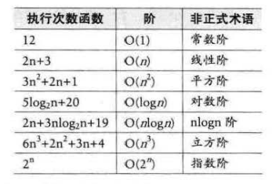

## 算法复杂度分析

参考：  
https://blog.csdn.net/daijin888888/article/details/66970902

算法复杂度又称时间复杂度和空间复杂度，数据库更关注时间复杂度的降低。
时间复杂度又分为：  
+ 平均情况
+ 最好情况
+ 最差情况

一般在没有特殊说明的情况下，都是指最坏时间复杂度。

所有算法的复杂度都可以用数学函数表示，常见函数的复杂度列表：  
  

