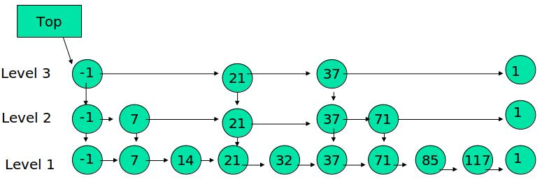

## 链表

这里约定一下：
假设把头节点HEAD和尾节点TAIL称作辅助节点。
假设链表有NODE1...NODEn， 共n个节点。

#### 单链表
HEAD为NODE1的引用，TAIL为NODEn的引用，
NODE1...NODEn，通过next一一链接。
    
#### 双端链表
单链表中HEAD和TAIL是分开的两个NODE引用，
双端链表将HEAD和TAIL包装在一起了。
    
#### 有序链表
链表中的数据通过关键值有序排列。插入前先遍历一下，找准位置再插入。
    
#### 双向链表
链表不仅有next引用还有prev引用。

## 链表的特点

相对于数组，插入删除比较快，查询比较慢；但是分开比较没有意义，实际应用中基本都是在指定
节点后插入或删除指定节点，就是说先查找再插入或删除。

但是链表比数组优越的一点是链表在内存使用效率比数组高，链表需要多少空间就分配多少空间，
但是数组一般是固定内存大小的，虽然向量Vector可以根据需要拓展，但是也只是以固定大小的
增量拓展。肯定会有内存的浪费。

## 其他链表相关数据结构

### 跳表

时间复杂度：O(logn), 空间复杂度2n。　
对比平衡树：空间复杂度多１倍，但是实现简单很多。

插入逻辑：  

先确定该元素要占据的层数 K（采用丢硬币的方式，从K=１开始如果抛出正面(假设为１)，则K+1,继续抛,如果为反面（假设为０），则当前K值则是元素占据的层数）;  
然后在 Level 1 ... Level K 各个层的链表都插入元素。

跳表的高度最高为64层，(1/2)^64是一个极低的概率，跳表一般也就几层。

搜索逻辑：

和树的查找其实类似。

删除逻辑：

标准的链表删除节点（只不过可能有好几层要删）。