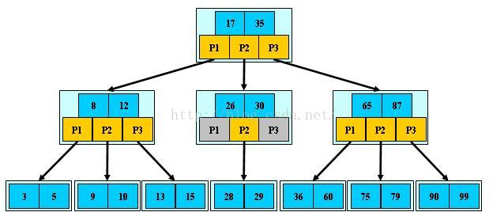
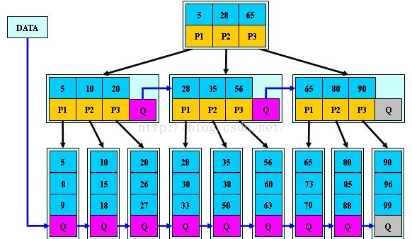

## 树
参考： 《算法导论》

#### 基本分类
+ 无序树
+ 有序树
    - 二叉树
        * 完全二叉树
        * 满二叉树
        * 二叉排序树
        * 平衡二叉树
        * 红黑树
    - 霍夫曼树
    - B树
        * B树（B-树）
        * B+树
        * B*树
    - 键树
    - 字典树
    - 后缀树
    - 区间树与线段树
    - 败者数与胜者树

#### 红黑树
红黑树多用于数据在内存中的排序存储。

#### B树
+ B树定义
    B树和B+树是为了处理磁盘访问而设计的数据结构（B树和B+树的结构类似于磁盘结构：盘面->磁道->扇区[每个扇区存储数据]），
    可以用于处理文件系统和数据库索引。
    B树的非叶节点也存储数据，B+树只在叶节点存储数据。B+树更类似磁盘结构。
    因为B树的数据本身还是链表，可以综合树和链表的特点实现比B树更快的查询（比如当查询连续或间隔较小的几个数据，
    第一个数据可以使用树的方式进行二分查找，后面几个数据直接使用链表查找）。
    
    参考《算法导论》第18章  
    国内教材说阶数m其实和最小度数是一个东西，最小度数要求键上限为2*t-1，那么它的子节点最多就是2*t, 即 m=2t 。
    
    
    
    B树数据结构定义：  
    父节点引用
    子节点引用链表
    key链表  
    
    关键操作：  
    - 插入
    - 查找
    - 删除
    
    B树查找算法复杂度分析：  
    对于最小度数为t， 键数为n 的B树，求最差情况下（树高度最高为最差情况，高度决定磁盘IO的多少）时间算法复杂度。  
    《算法导论》已经给出了分析，如下：
    对于n, t一定要使8树最高，则
    第0层： 一个节点，1个键，两个子节点；
    第1层： 每个子节点有t-1个键，t个子节点；
    ...
    第h层：每个叶节点有t-1个键。
    则有 n >= 1 + 2*(t-1) + 2t*(t-1) + 2t^2*(t-1) + ... + 2t^(h-1)*(t-1)
    即 n>= 1 + 2(t-1)*[1+t+t^2+t^3+t^(h-1)] = 1+2(t-1)*(t^h-1)/(t-1) = 2t^h-1
    即 h <= logt[(n+1)/2]
    因为t << n,
    所以复杂度为 O(log(n/2)), 或者说O(log(n)) 。
    
    疑问：最小度数 t=3  
                   G M P T X  
    A B C D E | J K | N O | Q R S | U V | Y Z   
    这颗B树插入 L 键，为何不是  
                   G M P T X  
    A B C D E | J K L | N O | Q R S | U V | Y Z  
    而是  
                       P   
                G M    |     TX  
    A B C D E | J K L | N O | Q R S | U V | Y Z  
    根节点为5个键有什么问题么？为什么还要分裂一次？  
    书上说为了确保每次分裂节点的时候，父节点都不是满的，不然的话子节点分裂一次，父节点还需要继续分裂一次，
    导致代码无法写了（代码是递归实现的）
#### B+树

+ B+树定义
    ```
    一棵m阶的B+树和m阶的B树的差异在于：
    1.有n棵子树的结点中含有n 个关键字；
    2.所有的叶子结点中包含了全部关键字的信息，及指向含有这些关键字记录的指针，且叶子结点本身依关键字的大小自小而大的顺序链接。 (而B树的叶子节点并没有包括全部需要查找的信息)
    3.所有的非终端结点可以看成是索引部分，结点中仅含有其子树根结点中最大（或最小）关键字。 (而B树的非终节点也包含需要查找的有效信息)
    ```
在数据库索引中使用，理解B+树对理解数据库索引很重要。  



为什么说B+树比B 树更适合实际应用中操作系统的文件索引和数据库索引？  
B+树的磁盘读写代价更低,B+树的非叶子结点并没有指向关键字具体信息的指针。
因此其非叶子结点相对B 树更小，如果把所有同一个非叶子结点的关键字存放在同一盘块中，那么盘块所能容纳的关键字数量也越多，
树的高度相应降低，数的高度就对应I/O的次数，查找效率相应提高。因为树的高度决定了磁盘读写的次数，相对内存处理速度，
磁盘I/O是非常耗时的操作，是查找效率的主要因素，降低树的高度就等于提高查询效率。

#### 红黑树

