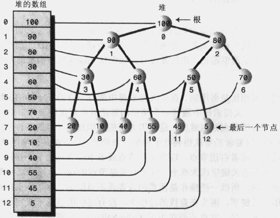

## 树
参考：    
《算法导论》  
《数据结构Java版》  
《数据结构与算法分析：java分析》  
《算法4》（红宝书）  
慕课网《玩转数据结构 从入门到进阶》  
维基百科对计算机科学树的总结  https://en.wikipedia.org/wiki/Template:CS_trees    
                          https://zh.wikipedia.org/zh-hans/Template:%E8%AE%A1%E7%AE%97%E6%9C%BA%E7%A7%91%E5%AD%A6%E4%B8%AD%E7%9A%84%E6%A0%91  

相关术语：  
节点层次（根节点层次为1）  
树的深度（高度）  
节点的度（节点分支个数）  
无序树与有序树（树中任意一个结点的各子树按从左到右是有序的，称为有序树，否则称为无序树。）  

注意：树是图的一种。  

疑问：线段树和区间树到底是不是同一种数据结构？
看英文的资料说 segment tree, interval tree, range tree是三种不同的数据结构，但是中文网上的博客翻译的乱七八招的。

#### 基本分类
从网上抄的一个分类表，这个分类有问题，后面全部理清重新分类。

+ 二叉树（每个节点最多只有两个子节点） 
    - 完全二叉树（若设二叉树的深度为h，除第 h 层外，其它各层 (1～h-1) 的结点数都必须达到最大个数，第h 层所有的结点都连续集中在最左边）
        * 满二叉树（一棵深度为k，且有2^k-1个节点的树是满二叉树）
    - 二叉排序树[二分搜索树] （左子树所有节点均小于根节点的值，右子树所有节点均大于根节点的值，左右子树也分别为二叉排序树）
    - 平衡二叉树（它或者是一颗空树，或者具有以下性质的二叉树：它的左子树和右子树的深度之差(平衡因子)的绝对值不超过1，且它的左子树和右子树都是一颗平衡二叉树。）
        * 线段树[Segment Tree]（是一种平衡二叉搜索树）
        * AVL树 (经典的自平衡二叉排序树)
        * 红黑树（自平衡的二叉排序树，但是不是严格平衡的）
            + 区间树 
    - 堆（一种完全二叉树，某个节点的值总是不大于或不小于其孩子节点的值，堆的每个子树也是堆）
+ 霍夫曼树
+ B树
    - B树（B-树）
    - B+树
    - B*树
    - 2-3树
    - 2-3-4树
+ 键树
+ 字典树[Trie]（又称前缀树，是专门为字符串设计的一种数据结构，其查询时间复杂度只与字符串的长度相关O(w), w为查询单词的长度）
+ 后缀树
+ 败者数与胜者树

#### 二叉排序树/二分搜索树（BST, Binary Search Tree）

定义：  
左子树所有节点均小于根节点的值，右子树所有节点均大于根节点的值，左右子树也分别为二叉排序树。

根据遍历时根节点的顺序分为前序遍历、中序遍历、后序遍历；  
前序遍历（根节点->左子节点->右子节点）  
中序遍历（左子节点->根子节点->右子节点）  
后序遍历（左子节点->右子节点->根子节点）  
层序遍历（又成为广度遍历，从顶向下一层一层的遍历，使用队列实现）

#### AVL树

##### 基本概念  
平衡因子：针对某个节点而言，若以此节点为根节点，左子树的高度减去右子树的高度，即为平衡因子，平衡二叉树的平衡因子为-1/0/+1。  

##### 定义（自己定义的）
在二叉排序树基础上添加某些平衡机制，使其同时满足平衡二叉树的特点，而生成的树。

##### AVL树的自平衡机制  

插入节点作为不平衡节点的左孩子的左孩子（LL），以及RR, 只需要右旋转或者左旋转即可。
如果插入节点作为不平衡节点的左孩子的右孩子（LR）, 则先将不平衡节点的左子树左旋转，然后再整体右旋转；对于RL，现将不平衡节点的右子树右旋转再整体左旋转。

左旋转和右旋转

    LL和RR:
           y                   y 
          / \                 / \
         x   T4              T4  x
        / \                     / \
       z   T3                  T3  z
      / \                         / \
     T1 T2                       T1 T2
  
    不平衡的二叉排序树都可以抽象为上面的两种结构, 左右旋转只是个操作的名字，
    如何保持平衡，想想应该也知道了。
  
         x
       /   \
      z     y
     /\     /\
    T1 T2  T3 T4
    
    LR和RL:
           y                   y 
          / \                 / \
         x   T4              T4  x
        / \                     / \
       T3  z                   z   T3
          / \                 / \
         T1 T2               T1 T2
    
    
##### AVL树的核心方法实现  

比较麻烦的方法主要是插入和删除节点，因为会影响树的平衡性。其他方法和BST一样，实现比较简单。

AVL树的数据插入： 数据插入过程是在BST插入过程基础上，又添加了平衡性判断以及维护平衡的操作；   
    1) 判断插入的数据键与左右子树的大小，递归插入到树中；  
    2）同样通过递归更新每个节点的高度计算平衡因子，当平衡因子绝对值大于等于2，  
    判断当前属于哪一种非平衡模型LL,RR,LR,RL;针对每种情况分别执行平衡措施；  
    3）因为方法本身是递归方法，可以逐级从底到顶维护自平衡。  
AVL树的数据删除： 在BST删除的基础上添加平衡性判断和操作。  
    1) （递归）选择被删除节点的前驱或者后继替代被删除节点的位置；  
    2）递归的每一层都更新节点高度并计算平衡因子，然后执行和插入同样的平衡操作。  

#### 红黑树

##### 红黑树被提出的原因

参考：   
《从2-3-4树到红黑树（上）》 https://www.cnblogs.com/nullzx/p/6111175.html

因为相比AVL树，红黑树通过颜色的控制，可以大幅减少旋转操作，而旋转操作是在插入删除节点时大量存在的，  
因此红黑树有比AVL树更高的插入删除效率，相对的平衡性略差于AVL在搜索上会比AVL效率略低一些，整体的性能红黑树是优于AVL树的。  

纠正一个问题：  
红黑树与2-3-4树是完全等价的，与2-3树不是等价的，下面2-3树替换为2-3-4树理解，而之所以等价还搞出个红黑树是因为红黑树的实现更为简单，
而2-3-4树的实现非常繁琐,2-3-4树作为一种概念，编程很少使用；  
《玩转数据结构 从入门到进阶》这门课说与2-3树是等价的其实不准确。   
因为碰到这种红黑树结构,有黑节点左右子节点都是红节点，红色代表融合，那么就是2-3-4树中的4节点，而2-3树只支持2节点和3节点。  
  

个人感觉通过2-3树实现的红黑树，实现相对更简单些，因为约束较多使得编程需要分情况处理的场景少了一些，但是旋转操作比2-3-4树实现的红黑树多，
AVL树的旋转操作更多。

红黑树与2-3树的关系  
参考《算法4》，红黑树在2-3树基础上提出，借助2-3树理解红黑树，通过2-3树理解红黑树，会发现红黑树的特性是理所当然的。  

**深入理解红黑树的几个必知的概念**  
理解红黑树的关键其实就是理解2-3树，以及红黑颜色的含义（好久之前研究红黑树，没有借助2-3树理解，花了一晚上看的还是云里雾里的，隔了两三天后就忘得一干二净了）。  
红色：代表与父节点融合，（对应的，黑色代表与父节点的分离）。    
红黑树是通过颜色翻转以及左右旋转实现树的平衡性的。  
从任意节点到叶节点经过的黑色节点也是相同的。  

2节点： 2个分支（存储一个元素）的节点；  
3节点： 3个分支（存储两个元素）的节点；  
4节点： 4个分支（存储三个元素）的节点。  

2-3树  
满足BST的基本性质，节点可以存放1个（两个子节点）或2个元素（三个子节点）；   
2-3树是一棵绝对平衡树（绝对平衡指任意节点子树的高度均相等）。     

  
2-3树插入流程  
首先与叶节点融合，融合之后为2节点则结束，为3节点则分裂，将分裂后的子树的根节点与3节点的父节点融合，继续判断融合之后的情况做相应的操作。  

然后回到红黑树，其实这里面的颜色的含义是与2-3中节点的融合是对标的，红色的含义表示当前节点是与父节点融合的，将融合的3节点拆分，
对应红黑树的操作就是将左右子节点变为黑色。

红黑树的节点数据结构  
```
class Node {
    public K key;
    public V value;
    public Node left, right;
    public boolean color;
    
    ...
}
```

##### 红黑树的核心方法

+ 节点颜色翻转   
    节点颜色置为红色，左右子节点颜色置为黑色；这个其实就是2-3树里面将3节点拆分，并将新生的子树的根节点与上面融合的过程，
    这是一个递归的单元，这个过程中树的平衡性是不会改变的。

    要插入的节点是红色的，因为2-3树插入节点首先是与叶节点融合。  

+ 向红黑树中插入元素：  
   
    首先一颗红黑树最底层肯定是下面情况(nil节点就不画了)  
    ```
      B       B      B
     / \     /        
    R   R   R
    ```  
    需要重新平衡的节点N与父节点P（P对应上面的R R R B B）模型如下几种,下面的黑色节点可能不在同一层，但是都指最下面的非空黑节点。  
    1）父节点为黑色;    
        不用处理，平衡操作完成；  
    2）父节点为红色，且父节点为祖父节点的左孩子；  
    2.1） 叔节点为红色；  
        父、叔节点设置为黑色，祖父节点设置为红色，节点N指向祖父节点，轮询或者递归1-2操作；  
    2.2） 叔节点为黑色；  
    2.2.1) N为父节点的左孩子  
        其实如下，叔节点为T4的根节点，T1, T2, T3, T4,从各自的根节点到叶节点的黑色节点必定是相等的；    
        父节点置为黑色，祖父节点置为红色，然后右旋转；结束平衡操作；  
    ```
           y(B)                
          /  \                   
         x(R) T4                
        /  \                      
       z(R) T3                   
      / \                        
     T1 T2 
    ```  
    2.2.2）N为父节点的右孩子  
        先以父节点为支点左旋，然后执行2.2.1操作。  
    3）父节点为红色，且父节点为祖父节点的右孩子；  
        操作和2对称。  

    上面写了好多还是不太好理解，直接看2-3-4树和红黑树的实例吧。  
    假如有20个1-100的不重复整数，插入到2-3-4树和红黑树中： 66 8 38 67 56 34 52 97 4 90 7 20 21 43 12 46   
    ```
    B:代表黑色，R:代表红色。
    
            66                                                  66B
    ------------------------------------------------  ------------------------------------------------
            8|66                                                66B
                                                               /
                                                             8R
    ------------------------------------------------  ------------------------------------------------ 
            8|38|66                                             38B
                                                                / \
                                                               8R  66R   父节点为黑色，新节点直接插入即可  
    ------------------------------------------------  ------------------------------------------------
            38                                                  38B
           /  \                                                 / \
          8    66|67                                           8B  66B
                                                                     \
                                                                     67R                 
                                                      父叔节点均为Red,插入节点后，将父叔节点改为Black,
                                                      祖父节点改为Red,然后从祖父节点继续向上平衡。
    ------------------------------------------------  ------------------------------------------------
            38                                                  38B
           /  \                                                 /  \
          8    56|66|67                                        8B   66B
                                                                    /  \
                                                                   56R  67R
    ------------------------------------------------  ------------------------------------------------ 
            38                                                   38B
           /  \                                                 /    \
         8|34  56|66|67                                        8B    66B
                                                                \    /  \
                                                                34R 56R  67R 
    ------------------------------------------------  ------------------------------------------------
            38|66                                                38B                38B
           /   |  \                                            /    \              /   \
        8|34 52|56 67                                         8B     66B          8B    66R
    这里先将56|66|67分裂，然后在56这个2各节点插入52，               \     /  \    =>    \     / \
    然后将66与38再合并。                                          34R 56R 67R         34R 56B 67B
                                                                    /                   /
                                                                   52R                 52R
    ------------------------------------------------  ------------------------------------------------
            38|66                                               38B
           /   |  \                                            /   \                        
        8|34 52|56 67|97                                     8B    66R
                                                              \     /  \
                                                              34R  56B 67B
                                                                   /     \
                                                                  52R     97R
    ------------------------------------------------  ------------------------------------------------ 
            38|66                                               38B
           /   |  \                                            /   \
      4|8|34 52|56 67|97                                     8B     66R
                                                            / \     /  \
                                                          4R  34R  56B 67B
                                                                   /     \
                                                                  52R     97R
    ------------------------------------------------  ------------------------------------------------
            38|66                                               38B                      38B                
           /   |  \                                            /   \                    /   \
      4|8|34 52|56 67|90|97                                  8B     66R                8B    66R
                                                            / \     /  \              / \    /  \
                                                          4R  34R  56B 67B   =>     4R  34R 56B 90B
                                                                   /     \                  /    / \
                                                                  52R     97R              52R 67R 97R
                                                                          /                
                                                                         90R                     
                                                      先以97为支点右旋转，将父节点置为Black,祖父节点置为Red,
                                                      再以67为支点左旋转。
    ------------------------------------------------  ------------------------------------------------
           8|38|66                                              38B
        /   /   |  \                                            /  \
      4|7 34 52|56 67|90|97                                    8R   66R
    这里先将4|8|34分裂，然后在4这个2各节点插入7，                  / \    /  \
    然后将8与38|66再合并。                                     4B  34B 56B 90B
                                                              \      /    / \
                                                               7R   52R  67R 97R
    ------------------------------------------------  ------------------------------------------------
           8|38|66                                               38B
        /   /   |    \                                          /    \
      4|7 20|34 52|56 67|90|97                                 8R     66R
                                                              /  \    /  \
                                                            4B   34B 56B  90B
                                                             \   /   /    /  \
                                                             7R 20R 52R  67R 97R            
    ------------------------------------------------  ------------------------------------------------
           8|38|66                                                 38B
        /   /     \     \                                        /      \
      4|7 20|21|34 52|56 67|90|97                              8R       66R
                                                              /  \      /  \
                                                            4B   34B   56B  90B
                                                             \   /  \   /    /  \
                                                            7R 20R 21R 52R  67R 97R   
    ------------------------------------------------  ------------------------------------------------
           8|38|66                                                 38B                             38B                      
        /   /    \         \                                      /    \                        /       \
     4|7 20|21|34 43|52|56 67|90|97                             8R      66R                   8R           66R
                                                               /  \      /  \                /  \        /     \       
                                                             4B   34B   56B  90B    =>     4B   34B     52B     90B
                                                              \   /  \   /    /  \          \   /  \    / \     /  \
                                                             7R 20R 21R 52R  67R 97R        7R 20R 21R 43R 56R 67R 97R
                                                                        /
                                                                       43R 
                                                       父节点是红色，叔节点为黑色，将祖父节点置为红色，父节点置为黑色，
                                                       以祖父节点为支点右旋转。
    ------------------------------------------------  ------------------------------------------------
                  38
              /       \
            8|21        66
         /    |  \    /      \
     4|7  12|20  34 43|52|56 67|90|97
    这里先将20|21|34分裂，然后在20这个2各节点插入12，
    然后将21与8|38|66再合并(同样包含分裂和提升的过程)。
    ------------------------------------------------  ------------------------------------------------
                  38
              /       \
            8|21       52|66
         /   |  \    /   |   \
      4|7 12|20 34 43|46 56 67|90|97
    
    RBTree.java 生成的红黑树：
    ---------------------97R
    --------------90B
    ---------------------67R
    -------66B
    ---------------------56B
    --------------52R
    ----------------------------46R
    ---------------------43B
    38B
    ---------------------34B
    --------------21R
    ---------------------20B
    ----------------------------12R
    -------8B
    ---------------------7R
    --------------4B
    ```                             
    
+ 删除红黑树中的元素  
    
    待续完善...

    1) 若 “x”是“它父节点的左孩子”，则设置 “w”为“x的叔叔”(即x为它父节点的右孩子)                                           
    Case 1: x是“黑+黑”节点，x的兄弟节点是红色。(此时x的父节点和x的兄弟节点的子节点都是黑节点)。  
      (01) 将x的兄弟节点设为“黑色”。  
      (02) 将x的父节点设为“红色”。  
      (03) 对x的父节点进行左旋。  
      (04) 左旋后，重新设置x的兄弟节点。  
    Case 2: x是“黑+黑”节点，x的兄弟节点是黑色，x的兄弟节点的两个孩子都是黑色。  
      (01) 将x的兄弟节点设为“红色”。  
      (02) 设置“x的父节点”为“新的x节点”。  
    Case 3: x是“黑+黑”节点，x的兄弟节点是黑色；x的兄弟节点的左孩子是红色，右孩子是黑色的。  
      (01) 将x兄弟节点的左孩子设为“黑色”。  
      (02) 将x兄弟节点设为“红色”。  
      (03) 对x的兄弟节点进行右旋。  
      (04) 右旋后，重新设置x的兄弟节点。  
    Case 4: x是“黑+黑”节点，x的兄弟节点是黑色；x的兄弟节点的右孩子是红色的。(01) 将x父节点颜色 赋值给 x的兄弟节点。  
      (02) 将x父节点设为“黑色”。  
      (03) 将x兄弟节点的右子节设为“黑色”。  
      (04) 对x的父节点进行左旋。  
      (05) 设置“x”为“根节点”。  
    2) 若 “x”是“它父节点的右孩子”，将上面的操作中“right”和“left”交换位置，然后依次执行。  

##### 通过2-3树理解红黑树的特性
（1）每个节点或者是黑色，或者是红色。  
    换句话说：每个节点要么是与父节点分离的要么是融合的；
（2）根节点是黑色。
    换句话说：根节点是与父节点分离的，这个肯定的，根节点没有父节点；
（3）每个叶子节点（NIL）是黑色。 [注意：这里叶子节点，是指为空(NIL或NULL)的叶子节点！]
    叶子节点在2-3树中不存在，当然是分离的，就对应黑色；  
（4）如果一个节点是红色的，则它的子节点必须是黑色的。
    节点为红色，表明它是与父节点融合的，如果子节点也是红色，子节点融合当前节点，当前节点再融合到父节点就变成了4节点（存储三个元素）不符合2-3树的特性。  
（5）从一个节点到该节点的子孙节点的所有路径上包含相同数目的黑节点。  
    红色节点是与父节点融合的，那么从一个节点到它的子孙节点的所有路径上黑色节点的数目就对应了这个节点在2-3树中到所有子孙节点的高度，而2-3是绝对平衡的树，
    所以这里的黑节点数目必须相同。
（*6）红黑树的红色节点总是左倾斜的（这个存在异议，有些人说是左倾,但是大部分资料没有这条约束）.
    因为习惯将3节点的后面那个元素作为根节点元素，而根节点是黑色的，则左侧元素作为子节点且是红色的，即红色节点总是左倾的。
    
    
#### 线段树

TODO: 不知下面的定义是否准确，网上的文章都是各种误导，各种和区间树的混为一谈。

线段树（存储区间） https://zh.wikipedia.org/wiki/%E7%B7%9A%E6%AE%B5%E6%A8%B9_(%E5%84%B2%E5%AD%98%E5%8D%80%E9%96%93)

线段树的定义：  
线段树是一种平衡二叉排序树，  
对于线段树中的每一个非叶子节点[a,b]，它的左儿子表示的区间为[a,(a+b)/2]，右儿子表示的区间为[(a+b)/2+1,b]。  
因此线段树是平衡二叉树，最后的子节点数目为N，即整个线段区间的长度。  

应用场景： 某些只关注区间的场景；  
如：实际应用中经常遇到区间查询场景，如电商查询某类产品在某个价格区间的产品列表；
如：区间染色的问题（对区间某个子区间进行染色，经过m次操作之后，可以在[i, j]区间看到多少种颜色？）。

上面的问题可以也可以使用数组解决，但是线段树的算法复杂度更低。

操作 | 数组实现 | 线段树实现 
---|---|--- 
更新 | O(n) | O(logn) 
查询 | O(n) | O(logn)

#### B树
+ B树定义
    B树和B+树是为了处理磁盘访问而设计的数据结构（B树和B+树的结构类似于磁盘结构：盘面->磁道->扇区[每个扇区存储数据]），
    可以用于处理文件系统和数据库索引。
    B树的非叶节点也存储数据，B+树只在叶节点存储数据。B+树更类似磁盘结构。
    因为B树的数据本身还是链表，可以综合树和链表的特点实现比B树更快的查询（比如当查询连续或间隔较小的几个数据，
    第一个数据可以使用树的方式进行二分查找，后面几个数据直接使用链表查找）。
    
    参考《算法导论》第18章  
    国内教材说阶数m其实和最小度数是一个东西，最小度数要求键上限为2*t-1，那么它的子节点最多就是2*t, 即 m=2t 。
    
    
    
    B树数据结构定义：  
    父节点引用  
    子节点引用链表  
    key链表  
    
    关键操作：  
    - 插入
    - 查找
    - 删除
    
    B树查找算法复杂度分析：  
    对于最小度数为t， 键数为n 的B树，求最差情况下（树高度最高为最差情况，高度决定磁盘IO的多少）时间算法复杂度。  
    《算法导论》已经给出了分析，如下：
    对于n, t一定要使8树最高，则
    第0层： 一个节点，1个键，两个子节点；
    第1层： 每个子节点有t-1个键，t个子节点；
    ...
    第h层：每个叶节点有t-1个键。
    则有 n >= 1 + 2*(t-1) + 2t*(t-1) + 2t^2*(t-1) + ... + 2t^(h-1)*(t-1)
    即 n>= 1 + 2(t-1)*[1+t+t^2+t^3+t^(h-1)] = 1+2(t-1)*(t^h-1)/(t-1) = 2t^h-1
    即 h <= logt[(n+1)/2]
    因为t << n,
    所以复杂度为 O(log(n/2)), 或者说O(log(n)) 。
    
    疑问：最小度数 t=3  
                   G M P T X  
    A B C D E | J K | N O | Q R S | U V | Y Z   
    这颗B树插入 L 键，为何不是  
                   G M P T X  
    A B C D E | J K L | N O | Q R S | U V | Y Z  
    而是  
                       P   
                G M    |     TX  
    A B C D E | J K L | N O | Q R S | U V | Y Z  
    根节点为5个键有什么问题么？为什么还要分裂一次？  
    书上说为了确保每次分裂节点的时候，父节点都不是满的，不然的话子节点分裂一次，父节点还需要继续分裂一次，
    导致代码无法写了（代码是递归实现的）
    
#### B+树
+ B+树定义
    ```
    一棵m阶的B+树和m阶的B树的差异在于：
    1.有n棵子树的结点中含有n 个关键字；
    2.所有的叶子结点中包含了全部关键字的信息，及指向含有这些关键字记录的指针，且叶子结点本身依关键字的大小自小而大的顺序链接。 (而B树的叶子节点并没有包括全部需要查找的信息)
    3.所有的非终端结点可以看成是索引部分，结点中仅含有其子树根结点中最大（或最小）关键字。 (而B树的非终节点也包含需要查找的有效信息)
    ```
在数据库索引中使用，理解B+树对理解数据库索引很重要。  


为什么说B+树比B 树更适合实际应用中操作系统的文件索引和数据库索引？  
B+树的磁盘读写代价更低,B+树的非叶子结点并没有指向关键字具体信息的指针。
因此其非叶子结点相对B 树更小，如果把所有同一个非叶子结点的关键字存放在同一盘块中，那么盘块所能容纳的关键字数量也越多，
树的高度相应降低，数的高度就对应I/O的次数，查找效率相应提高。因为树的高度决定了磁盘读写的次数，相对内存处理速度，
磁盘I/O是非常耗时的操作，是查找效率的主要因素，降低树的高度就等于提高查询效率。


#### 堆  

堆这种数据结构的应用场景并不是很多，比较常见的两种应用场景是：堆排序和优先事件模拟（当做优先队列使用）。

+ 堆的定义：  
    1）它是完全二叉树（除了最后一层节点不是满的，其他每一层从左到右都是满的）；  
    2）堆树中某个节点的值总是不大于或不小于其孩子节点的值;  
    3）堆树中每个节点的子树都是堆树。  
    
    最大堆：父节点的键值总是大于或等于任何一个子节点的键值；    
    最小堆：父节点的键值总是小于或等于任何一个子节点的键值。  
    
    常用一个数组实现（为何使用数组而不是由引用连接起来的各个节点来存储二叉树？）  
    注意： 父节点索引 pindex 与子节点索引 cindex 关系 : pindex = ceil(cindex/2)-1 如：索引为5的父节点对应两个索引分别为11,12的子节点。
    堆相比于二叉搜索树是弱序的。  
    
+ 堆与数组对应关系
    
    
    堆的插入 insert() 算法 （数据结构(Java版) C12P438）  
    插入新元素后需要堆仍旧保持堆的特性，插入的时候总是先插入到最后，然后一级一级地与父节点比较，
    新节点大于父节点就交换位置，否则直接退出。
    
    堆的移除 remove() 算法
    总是移除堆顶，然后将最后一个子节点放在堆顶，然后再比较左右子节点，与较大的子节点交换位置，
    这样一级一级比下去。
    
    理解了父子节点的对应关系，以及insert remove操作原理，就很容易实现堆的数据结构。
    
#### 字典树【Trie】

字典树是一种多叉树，将每一个字符作为一个节点，垂直方向上的字符组成应用中的一个字符串。  

字典树的优势：存储大量字符串的时候，比较节省空间，如果使用二叉排序树存储的话，一个节点需要存储一个字符串，而字典树每个节点只需要存储一个字符，
且字典树存储相等数量的字符串，使用的节点数目远小于二叉排序树。

字典树的结构  
  

```
//常规的字典树的节点的定义
class Node{
    char c;
    Node next[26];  //使用数组存储子节点，同样可以使用链表、Set、树存储。
}

//这里使用TreeMap替换数组存储子节点。
//使用TreeMap存储每一层字符。root.next是TreeMap实例存储第一层字符(如：c d b), 然后每个TreeMap节点的next引用又是一个TreeMap实例，
//存储第一层每个字符下的第二层字符，后面同理。
class Node {
    boolean isWord;         //表示是否为单词结尾
    Map<char, Node> next;   
}
```

核心方法  
添加单词：依次从字符串中取出字符，从根节点开始判断字符是否存在，不存在则循环创建后续节点，存在则继续判断下一个字符在前一个字符节点下是否存在。
查询单词：依次从字符串取出字符，从根节点开始判断字符是否存在，不存在退出返回false,否则在子节点递归查后面的字符。
前缀查询节点：同上基本类似。
模式匹配：同上类似。
删除单词：递归删除，判断最后一个字符是否isWord为true, 然后判断节点是否无其他分支，无其他分支删除此节点，有其他分支直接isWord设置为false,
        递归倒数第二个节点，是否还有其他分支，无其他分支则删除节点继续递归，否则退出；

